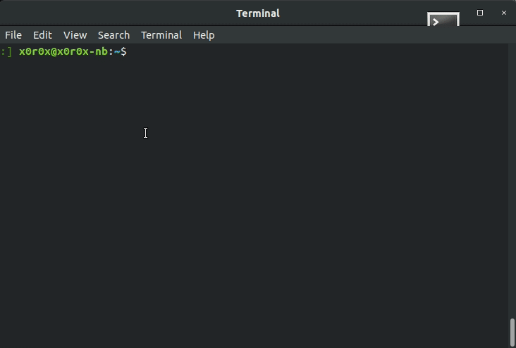

## CLI Torrent Downloader

#### About
CLI Torrent Downloader provides convenient and quick way to search torrent  
magnet links (and to run associated torrent client) via major torrent sites 
(ThePirateBay, LimeTorrents, Zooqle, 1337x, GloTorrents, KickAssTorrents, 
SolidTorrents by default) through command line.

#### Prerequisites
* Python 3.8

#### Installation   

    $ virtualenv .venv38
    $ . .venv/bin/activate
    $ pip3 install -r requirements.txt

optional:

    $ sudo ln -s tordl.sh /usr/local/bin

#### Config
Edit `~/.torrent_dl/config.json` to customize your preferred torrent client and 
browser (default is qbittorent and firefox).

#### Usage

##### CLI Usage
Run search from command line:

    $ tordl star wars IV

Show help:

    $ tordl -h

##### Browse Mode Usage
* KEY_DOWN, KEY_UP, PAGE_UP, PAGE_DOWN - Navigate
* ENTER - Run torrent client
* SPACE - Open torrent info URL in browser
* ESC - exit
* / - Search
* a - Sort by source (torrent search engine) 
* s - Sort by seeds (default)
* d - Sort by leechers 
* f - Sort by size
* m - Load more search results (if possible)
* p - Search engines selection

##### Search Mode Usage
* KEY_UP - Move to previous in search history
* KEY_DOWN - Move to next in search history
* ENTER - Search
* ESC - Exit search

##### Search Engine Selection Usage
* KEY_UP, KEY_DOWN - Navigate
* ENTER, SPACE - Check / Uncheck selected search engine
* ESC - Save and exit engine selection
* BUTTON_OK - Save and exit engine selection
* BUTTON_SAVE - Persist selection in config and exit engine selection

#### Creating own search engine extensions
See `~/.torrent_dl/engines.py` and `~/.torrent_dl/config.json#search_engines`.